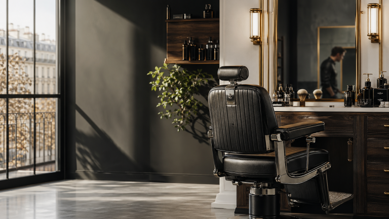

# Barber Architecte V201

A custom WordPress theme built for **Barbershop L'Architecte** — a premium barbershop and hair salon. The theme provides a complete front-end experience with a hero section, online booking, dynamic services and team listings, and a rich footer, all powered by the [Salon Booking](https://salonbookingsystem.com/) plugin.



---

## Features

- **Hero section** — Full-screen banner with background image, welcome copy, team member cards, and call-to-action buttons linking to the booking widget
- **Live open/closed status** — Top bar displays real-time open or closed status based on configurable business hours (timezone-aware)
- **Online booking** — Embeds the `[salon]` Salon Booking shortcode directly in the hero; degrades gracefully when the plugin is not active
- **Services grid** — Automatically pulls services (`sln_service` post type) from Salon Booking, displaying title, excerpt, duration, and price
- **Team grid** — Automatically pulls attendants (`sln_attendant` post type) from Salon Booking with their photos
- **Sticky header** — Transparent header that gains a solid background on scroll; includes logo, primary navigation, and a "Book" CTA button
- **Mobile navigation** — Accessible hamburger menu with backdrop, slide-in panel, social links, and keyboard (`Escape`) support
- **Custom logo** — Supports the WordPress custom logo feature via the Customizer
- **Footer** — Four-column premium footer with brand info, services list, opening hours, and contact details (phone, email, address)
- **Dark colour scheme** — CSS custom properties for consistent dark gold/rust/green palette across the entire theme

---

## Requirements

| Requirement | Version |
|---|---|
| WordPress | 6.0 or higher |
| PHP | 8.1 or higher |
| Salon Booking plugin | Recommended (booking widget, services and team data) |

---

## Installation

1. Download or clone this repository into your WordPress themes directory:
   ```bash
   cd wp-content/themes/
   git clone https://github.com/m-idriss/barber barber-architecte-v201
   ```
2. In the WordPress admin, go to **Appearance → Themes** and activate **Barber Architecte V201**.
3. Install and activate the [Salon Booking](https://salonbookingsystem.com/) plugin to enable the booking widget, services list, and team grid.

---

## Configuration

### Logo
Go to **Appearance → Customize → Site Identity** and upload your logo. The theme accepts images at 120 × 120 px (flexible width/height supported).

### Navigation menu
Go to **Appearance → Menus**, create a menu, and assign it to the **Menu principal** location.

### Business hours
Business hours are defined in `functions.php` inside the `ba_v201_business_hours()` function. Edit the array to match the salon's schedule:

```php
function ba_v201_business_hours(): array
{
    return [
        0 => null,               // Sunday — closed
        1 => ['09:00', '19:00'], // Monday
        2 => ['09:00', '19:00'], // Tuesday
        3 => ['09:00', '19:00'], // Wednesday
        4 => ['09:00', '20:00'], // Thursday
        5 => ['09:00', '20:00'], // Friday
        6 => ['10:00', '18:00'], // Saturday
    ];
}
```

### Contact details and address
Update the phone number, email address, and postal address directly in `header.php` (top bar) and `footer.php` (contact column).

### Hero image
The hero background image is loaded via `ba_v201_upload_url()` in `front-page.php`. Upload the image through the WordPress Media Library and update the path passed to the function if needed.

### Theme updates
Administrators can review GitHub-powered theme releases from **Appearance → Theme updates**. The page includes the latest release notes, a manual **Check for updates** action, and direct links to install or inspect the current GitHub release.

---

## Theme Structure

```
barber-architecte-v201/
├── footer.php          # Site footer (CTA, columns, legal links)
├── front-page.php      # Home page template (hero, services, team)
├── functions.php       # Theme setup, asset enqueue, helper functions
├── header.php          # Top bar, site header, mobile navigation
├── index.php           # Fallback template
├── page.php            # Standard page template
├── screenshot.png      # Theme preview image
├── single.php          # Single post template
└── style.css           # Theme stylesheet (metadata + all styles)
```

---

## License

This theme is a bespoke project. All rights reserved by the author.
